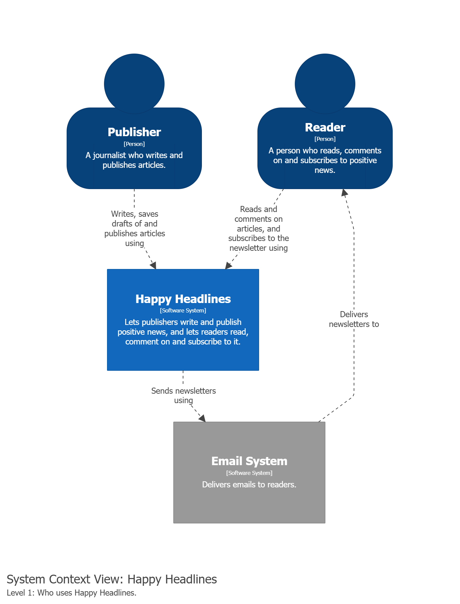

# Week 35 – C4 diagrams

The first two C4 levels of Happy Headlines.

## Level 1 – System context



## Level 2 – Containers


## Assumptions

- Newsletters are sent through an external Email System.
- NewsletterService reads new subscribers from the SubscriberQueue.
- No technologies yet – they are chosen in later weeks.

## Run

```sh
docker compose up
```

Open http://localhost:8080
