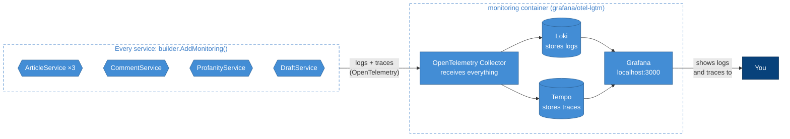
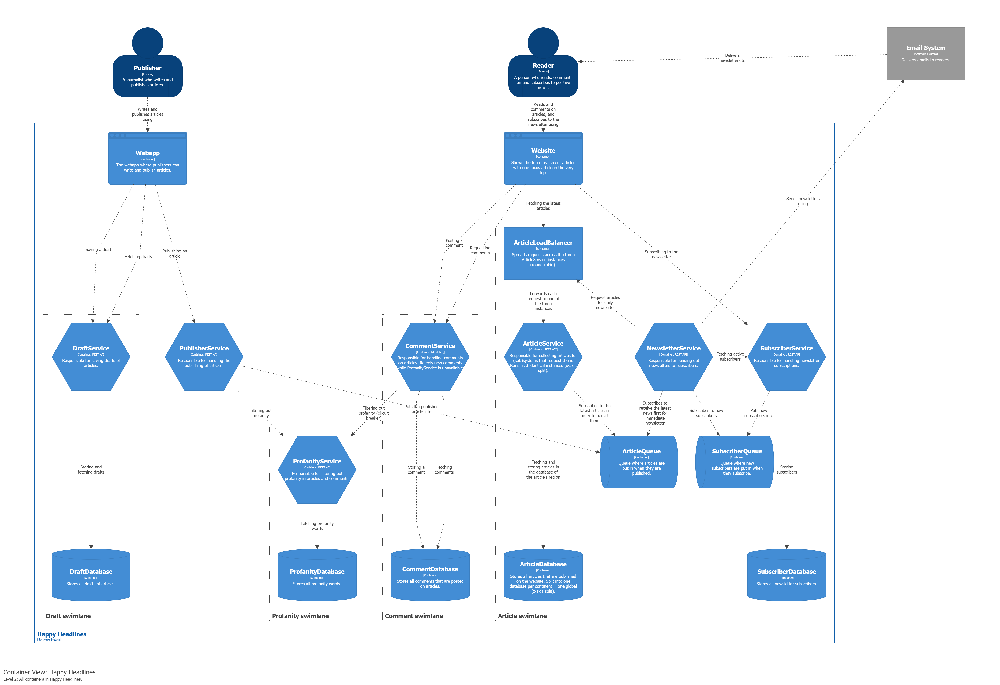

# Week 38 – DraftService, logging and tracing

- **DraftService** lets publishers save, fetch, update and delete drafts. It has its own database (Draft swimlane).
- **Central logging and tracing:** every service sends its logs and traces with OpenTelemetry to one monitoring
  container, where Grafana shows them. The setup is written once, in the shared `src/Monitoring` library,
  and each service turns it on with one line: `builder.AddMonitoring()`.

## How logs and traces flow



## What to log, and when

| Level | When | Example |
|-------|------|---------|
| **Information** | something changed | `Draft 517b… created by Christian` |
| **Warning** | something went wrong, but it was handled | `Draft 1111… not found`, `Comment rejected because ProfanityService is unavailable` |
| **Error** | something unexpected | an exception |
| **Never** | text of drafts, comments and articles, passwords, personal data beyond the author name | log **ids, not content** |

- The framework's own messages are only logged from Warning, so our lines are not drowned out.
- Every log line carries the **trace id** of its request, so a log line and its trace are one click apart.
- Traces show every incoming request, every call to another service and every database query – except the API docs pages.
- Monitoring is not on the critical path: no service depends on the monitoring container, so if it is down the system keeps working.

## Finding logs and traces in Grafana

Open http://localhost:3000.

- **Logs:** menu → *Drilldown* → *Logs* → pick a service. Open a log line and click **Trace** to jump to its trace.
- **Traces:** menu → *Drilldown* → *Traces*. A posted comment shows one trace across two services:
  CommentService → ProfanityService → database.

## C4 container diagram



## Run

```sh
docker compose up -d --build
```

| URL | What |
|-----|------|
| http://localhost:3000 | Grafana (logs and traces) |
| http://localhost:8081/swagger | ArticleService (through the load balancer) |
| http://localhost:8082/swagger | CommentService |
| http://localhost:8083/swagger | ProfanityService |
| http://localhost:8084/swagger | DraftService |
| http://localhost:8080 | C4 diagrams |

Ready-made requests: [DraftService.http](src/DraftService/DraftService.http), [CommentService.http](src/CommentService/CommentService.http), [ProfanityService.http](src/ProfanityService/ProfanityService.http), [ArticleService.http](src/ArticleService/ArticleService.http).
