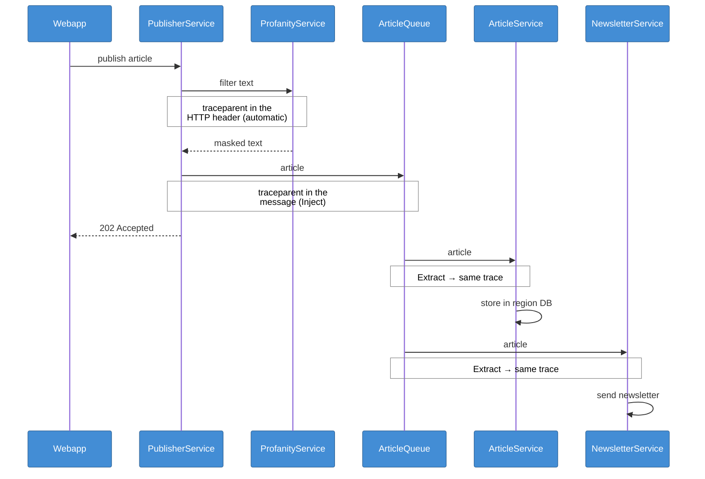

# Week 39 – Publishing through a queue, with unbroken traces

- **PublisherService** checks a new article for profanity (same circuit breaker as comments), puts it on the
  **ArticleQueue** and answers `202 Accepted` right away – it doesn't wait for anyone.
- **ArticleQueue** is RabbitMQ (used through EasyNetQ). Every subscribing service gets its own copy of each article:
  - **ArticleService** stores it in the database of its region. The 3 instances share one queue, so it is stored once.
  - **NewsletterService** sends an immediate newsletter. Once a day it also asks ArticleService for the articles of the
    last 24 hours from all regions. (Sending is pretend for now: a log line.)
- **Traces stay whole across the queue.** HTTP calls get the `traceparent` header automatically, a queue message
  doesn't. So the trace context is put into the message by hand ([Tracing.cs](src/Monitoring/Tracing.cs)):
  `Inject` before publishing, `Extract` after receiving.

## How one trace crosses the queue



## Try it

Publish an article with [PublisherService.http](src/PublisherService/PublisherService.http), then open Grafana →
*Drilldown* → *Traces* → `POST api/articles`: **one trace** with PublisherService, ProfanityService, ArticleService
and NewsletterService.

| What happens when … | Result |
|---|---|
| ProfanityService is down | `503`, the article is not published (circuit breaker) |
| RabbitMQ is down | `503`, the article is not published |
| all 3 ArticleService instances are down | `202` – the article waits in the queue and is stored when they are back; still one trace |
| ArticleService can't store an article | the message moves to the error queue (visible in RabbitMQ), nothing is lost |
| the same article arrives twice | it is stored once |

## C4 container diagram


## Run

```sh
docker compose up -d --build
```

| URL | What |
|-----|------|
| http://localhost:3000 | Grafana (logs and traces) |
| http://localhost:15672 | RabbitMQ – the ArticleQueue (guest / guest) |
| http://localhost:8085/swagger | PublisherService |
| http://localhost:8086/swagger | NewsletterService |
| http://localhost:8081/swagger | ArticleService (through the load balancer) |
| http://localhost:8082/swagger | CommentService |
| http://localhost:8083/swagger | ProfanityService |
| http://localhost:8084/swagger | DraftService |
| http://localhost:8080 | C4 diagrams |

Ready-made requests: [PublisherService.http](src/PublisherService/PublisherService.http), [NewsletterService.http](src/NewsletterService/NewsletterService.http), [ArticleService.http](src/ArticleService/ArticleService.http), [CommentService.http](src/CommentService/CommentService.http), [ProfanityService.http](src/ProfanityService/ProfanityService.http), [DraftService.http](src/DraftService/DraftService.http).
