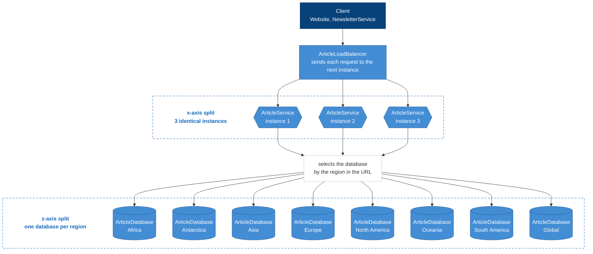

# Week 36 – ArticleService

A REST API for articles (create, read, update, delete), scaled in two ways:

- **x-axis split:** 3 identical ArticleService instances behind an nginx load balancer.
- **z-axis split:** one PostgreSQL database per continent + one for global news (8 in total).

## How ArticleService scales



## C4 container diagram


## Run

```sh
docker compose up -d --build
```

| URL | What |
|-----|------|
| http://localhost:8081/swagger | API docs (through the load balancer) |
| http://localhost:8080 | C4 diagrams |

## Endpoints

| Method | URL |
|--------|-----|
| GET, POST | `/api/regions/{region}/articles` |
| GET, PUT, DELETE | `/api/regions/{region}/articles/{id}` |

Regions: `africa`, `antarctica`, `asia`, `europe`, `northamerica`, `oceania`, `southamerica`, `global`.

Ready-made requests: [ArticleService.http](src/ArticleService/ArticleService.http). The `X-Instance` response header shows which instance answered.
