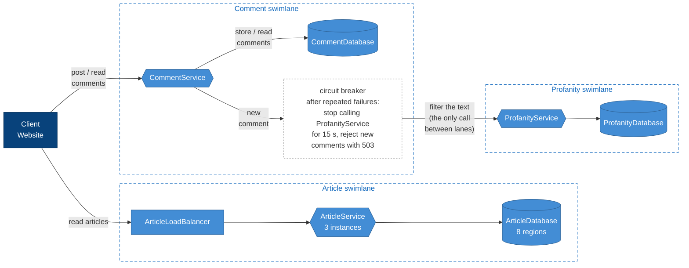

# Week 37 – CommentService, ProfanityService and swimlanes

- **CommentService** stores comments on articles. Before a comment is saved, its text is sent to ProfanityService.
- **ProfanityService** replaces prohibited words with asterisks and manages the word list.
- **Swimlanes:** Article, Comment and Profanity each have their own service(s) and database(s), and share nothing.
- **Circuit breaker:** if ProfanityService keeps failing, CommentService stops calling it for 15 seconds
  and rejects new comments with `503 Service Unavailable`. Reading comments keeps working.

## Swimlanes and the circuit breaker



## C4 container diagram


## Run

```sh
docker compose up -d --build
```

| URL | What |
|-----|------|
| http://localhost:8081/swagger | ArticleService (through the load balancer) |
| http://localhost:8082/swagger | CommentService |
| http://localhost:8083/swagger | ProfanityService |
| http://localhost:8080 | C4 diagrams |

## Circuit breaker demo

1. `docker compose stop profanity-service`
2. Post a comment a few times: `503`, and after 3 failures the answer is instant – the circuit is open.
   `docker compose logs comment-service` shows `Circuit OPEN`.
3. Reading comments still works.
4. `docker compose start profanity-service`, wait 15 seconds and post again: `201 Created`.
   The log shows `Circuit HALF-OPEN` and `Circuit CLOSED`.

Ready-made requests: [CommentService.http](src/CommentService/CommentService.http), [ProfanityService.http](src/ProfanityService/ProfanityService.http).
